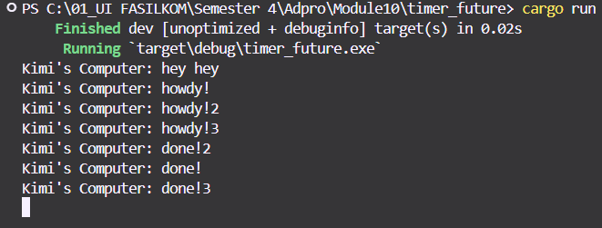

# Reflection
## Result of Execution 

 
Dalam kode ini, "hey hey" di-print sebelum "howdy!" dan "done!" karena fungsi `main` menjalankan perintah print "hey hey" terlebih dahulu yang dilanjutkan dengan menjalankan dua perintah print yang ada pada queue di executor.
 
## Multiple Spawn 

## Removing Statement: `drop(spawner);` 

## Putting it in again 

 
Saat menjalankan multiple spawn, seluruh task yang di-spawn akan dijalankan bersamaan. Dalam kode, terdapat timer yang menunggu 2 detik sebelum dicetaknya semua string "done". Maka dari itu, program akan mencetak semua string "howdy" terlebih dahulu lalu kemudian dilanjutkan dengan mencetak seluruh string "done".  
Saat statement `drop(spawner)` dihapus, program akan bekerja seperti biasanya, tetapi program tidak akan selesai karena `drop(spawner)` bertujuan untuk memberi tahu program bahwa tidak akan ada lagi tugas yang ditambahkan kepada executor. Maka, ketika `drop(spawner)` dihapus, program akan tetap menunggu datangnya tugas baru.